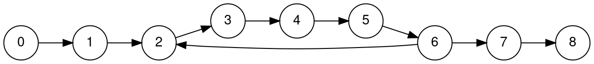

## Turing machines
general models of computation, to show that something is impossible (certain algorithms do not exist to solve some problems).

TMs are all FSMs, so they have finite states and finite input, but infinitely long tape. a Turing machine can either converge (aka terminate, halt) or diverge: 
1. eventually accept -> enter accept state
2. eventually rejects -> enter reject state
3. diverge (i.e. not halt)

a TM is a 7 tuple:
- state set
- multiple alphabets $\Sigma$, also called the "input alphabet". $\_{}\not\in \Sigma$
- tape alphabet (every symbol that could appear on the tape) $\Gamma$
- transition function $\delta$: from a position on the tape with a certain state and input $Q\times \Gamma$, we can go to another state, rewrite the current cell, and move the head left or right $Q\times \Gamma \times \{ L, R \}$
- initial state
- accept state
- reject state

a TM can also have multiple tapes. this doesn't really affect the overall power of the TM, just makes it faster.

anything a non-deterministic TM can do, a TM can also do (with extra steps). non-determinism does not give a TM extra power.

## decidability
a set $S$ of strings is **decidable** (or **computable**, or **recursive**) if there exists a TM that:
- when input any string $s\in S$, eventually accepts
- when input any string $s \not \in S$, eventually rejects
either way, they need to **halt**. *divergence is not allowed*.
### the Church-Turing thesis
lambda calculus (founded by Church) is good for programs, TMs are good for resource analysis and computation complexity.

a thesis because the notion that TM $\equiv$ algorithms cannot be proven, because TM is trying to model something that needs a definition.
### halting problem
let $H = \{ \text{all pairs} <M, s> | M\text{ halts on input }s \}$
theorem: $H$ is undecidable

proof: assume, for the sake of obtaining a contradiction, that $H$ is decidable.

then, $\exists$ an always halting TM $M_{1}$ that inputs $<M, s>$  and:
- if $M$ halts on $s$, $M_{1}$ accepts.
- else, $M_{1}$ rejects.

next, define a TM $M_{2}$ that takes input $M_{3}$. suppose that $M_{2}$ runs $M_{1}$ as a subroutine (knowing that $M_{1}$ always halt):
- if $M_{1}$ accepts $<M_{3}, M_{3}>$, then $M_{2}$ enters and infinite loop. 
- else, $M_{2}$ accepts.

consider $M_{2}$ on an input $M_{2}$. using $M_1$ as an oracle to tell us the behavior of the program, we do the opposite.

so:
- if $M_{1}$ says that $M_{2}$ halts, $M_{2}$ will not halt. 
- if $M_{1}$ says that $M_{2}$ does not halt, then it halts. 

there will always be a contradiction, and thus, such a Turing machine cannot exist, and $H$ is undecidable.
### Rice's theorem
you can generalize the halting problem to basically every non-trivial aspect, i.e. "does a program do whatever?"

trivial aspects would be a question where the answer is always "yes" or always "no", such as "can you add another extra state into the Turing machine?" it is always "yes" because you can add any number of useless states.

Rice's theorem states: **every non-trivial property of programs is undecidable.** therefore, compilers can't also tell any non-trivial property of a program (e.g. will it ever halt).
### is perfection achievable?
it's undecidable to even implement a perfect compiler. no matter what we do, an expert human can implement assembly of a program much better than a machine ever could.

so, the problem of fully optimizing programs is undecidable. a fully opimizing compiler produces, $\forall$ source programs $S$, optimal (most efficient, fewest instrs) target code $\equiv S$.

#### the full-employment theorem
**proof**: assume that fully-optimizing compiler $C$ exists. additionally, consider source pgm $p$ without I/O.

then, $C(p)$ produces the optimal, non-terminating target program $\Rightarrow$ $p$ diverges. 

an optimal, non-terminating target program for DISM can look like `jmp r 0`, which jumps to itself always. basically, a "perfect" compiler will need to solve the halting problem itself.
## actual optimizations
### register allocation (regalloc)
**goal**: store temporaries in registers to minimize loads and stores. 
**method**: 
1. generate preliminary target code, but assume that we have **infinite** registers (for temporaries)
2. perform **liveness analysis** on the preliminary target code (determine which registers hold value that may be used in future (alive) at all points in program, same idea as garbage collection)

```
r1 <- 1
r4 <- 0

#1: r3 <- r4 + 1
r2 <- r3 + r2
r4 <- r3 * 2
r4 < 100 => goto #1

print r2
print r1
```

2a. built a control flow graph (CFG, graph of the program). nodes are instructions, and **directed edge** $(i, j)$ if and only if instruction $j$ can **immediately** follow $i$ during exec.



2b. $\forall$ edges $e$ in the CFG, determine which regs are **live** at $e$.

wherever a register is overwritten, remove it from the live set (because the value it had before does not matter anymore). TODO: differentiate *definition* and *usage*.

this algorithm is iterative. so, we keep iterating until we cannot make changes anymore.

3. merge (coalesce) whatever that are never live together at the same time. 
in the above program, r3 and r4 is coalesced.

```
r1 <- 1
r3 <- 0

#1: r3 <- r3 + 1
r2 <- r3 + r2
r3 <- r3 * 2
r3 < 100 => goto #1

print r2
print r1
```

4. if we still have more registers than what the machine allows, start spilling them onto the stack (to free that register).

assuming that we only have 2 register allowed:
```
r1 <- 1
^push r1 onto program stack
// now, coalesce r1 and r3 (r1 is free for use)
r1 <- 0

#1: r1 <- r1 + 1
r2 <- r1 + r2
r1 <- r1 * 2
r1 < 100 => goto #1

print r2

// reset r1
^pop r1 off of program stack
print r1
```
### side notes
quines are programs that outputs itself.

the set of real number $\mathbb{R}$ is uncountably infinite. proof with Cantor's diagonalization.
