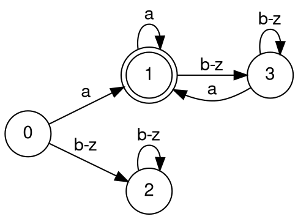
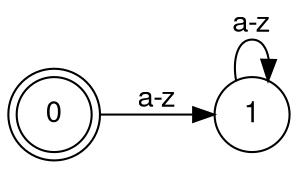
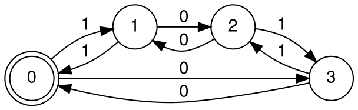

## what is?
the semantic values clarify the meaning of tokens.

some examples for tokens:
- identifiers: user-defined strings
- data types

## implementation
what the lexer does, is that it parses characters in real time as it is processed. the algorithm goes:

```txt
algorithm:

repeat:
	1. reach chars one at a time until we receive the next token T. if there is no such T, the program wil result in an error. 
	2. send T to the output stream
until EOF is reached.
```

modern lexers found that embedding the transition table into code (via `switch` statements) make it runs faster. the program loop looks something like:

```c
while ((input = getSym()) != EOF) {
	switch (state) {
		case 0:
			switch (input) {
				// etc.
			}
		
		// etc.
	}
}
```

we want our lexer to be a **deterministic** [[finite automata]], meaning that, for any current state and any current input, there is **exactly one next state**.

given a string $s:$ $\sigma_{1}\sigma_{2}\sigma_{3}\dots\sigma_{n}$of a DFA $D$'s alphabet, D accepts (recognizes) $s$ if and only if the transitions it makes on $\sigma_{1}$, $\sigma_{2}$,... $\sigma_{n}$ (starting at $q_{0}$) end in an accepting state. otherwise, D rejects $s$.

- a language is a set of strings.
- a programming language is a set of strings where each string specifies how a machine should operate (aka a program).
- a language of a DFA is the set of all strings it accepts.
- any finite language can be accepted by a DFA.

for example, a DFA that accepts all strings of lower-case letters that begin and ends with an "a":



a DFA that accepts only the empty string:



a DFA that accepts binary numbers of even number of 0s and even number of 1s:



DFA accepting all binary number of the form $0^{n}1^{n}$, where $n\in N$:
this language cannot be accepted by a DFA. because the DFA has a finite number of states, however many states are allocated out for counting the amount of 0s, we would need the same amount of states to count the 1s.

meaning, if you have 1 million states, a language with 1,000,001 states will exhaust the states. so, this DFA is impossible. **however,** bounding $n$ with an actual number will mitigate this problem, e.g. $n \leq 200$, by making it a finite language.

## regex
a regular expression can be formed in the following ways:
- a symbol $\sigma$, e.g. "a"
- empty string $\epsilon$
- the empty set $\varnothing$, which is different from the empty string $\{ \epsilon \}$
- concatenation $R_{1}\cdot R_{2} \equiv R_{1}R_{2}$
- alternation $R_{1}\mid R_{2} \equiv \{R_{1},R_{2}\}$
- replication (exponentiation), 0 or more replications: $R^*$

syntactic sugar:
- `[abc]` = $a\mid b\mid c$
- `R?` = $R \mid \epsilon$

## lex files
lex files end with `.l`, and the process to convert into C code goes:

`*.l` file $\to$ flex $\to$ `lex.yy.c`
### structure
a format of a `.l` file include:

```l
defs
%%
rules
%%
auxiliary routines
```

`def`s can include:
1. lex options
	- `%option yylineno` $\to$ lexer + parser maintain a variable, `yylineno`, to store the current source code line number (in case there is a syntax error causing program to crash)
	- `%option noyywrap` $\to$ don't handle multi-file source programs
2. C declarations
	- use the `%{ %}` to insert a literal, inserted verbatim on top of the `lex.yy.c` generated file.

``` 
%{
#define DEBUG_LEX 0
#include <stdio.h>
%}
```

3. regex macros

```c
digits: `[0-9]`
whitespace: `[ \t\r\n]+`
```
### rules
list of regexes + code to execute when each of the regexes get matched. for example:

```c
add              {return ADD_TOKEN}
"-"?{digit}+     {return INT_TOKEN}
{ws}             {// do nothing}
```

two **very important** notes:
C code in `.l` files can access:
- `yytext`: string in source code that most recently matched a regex
- `yyin`: lex input file (default is `stdin`)
- `input()`: function to read and consume a character from source code

precedence matching (when a substring of source code may match more than 1 regex) is handled with the rules of:
- match longest possible substring to a rule. for example, `\sifa\s` can match both `IF ID(a)` or `ID(ifa)`. following this rule, this token is lexed into `ID(ifa)`
- if **more than 1 rule** matches the same-length string, **match the first rule** in the regex list. for example, 

### the three cross filters
- lexical errors: errors in lexing, such as an illegal character
- parse errors: errors in parsing and syntax, despite being lexically valid. for example, `867yy ;` can be lexed into `NAT_LIT(867) ID(yy) SC`, but this cannot be parsed.
- type checking
